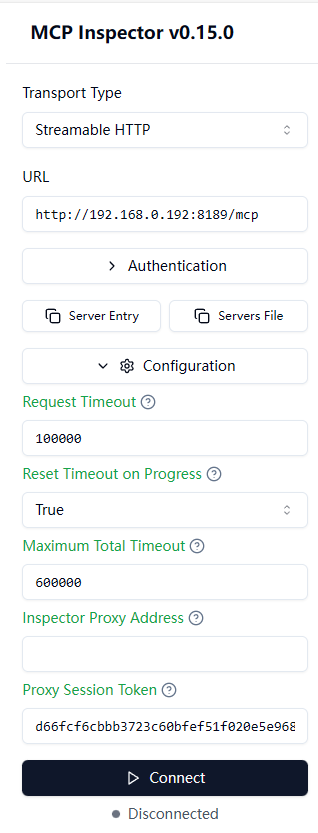
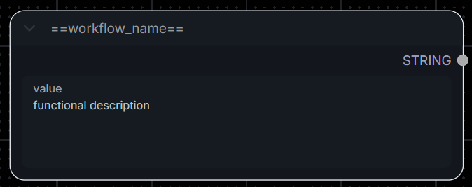
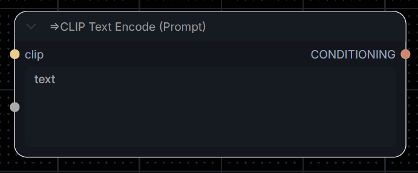

# ComfyUI-MCP-Server - ComfyUI Model Context Protocol Integration

<p align="center">
   [<a href="./README.md">简体中文</a>] 
   [<a href="./README-en.md">ENGLISH</a>] 
</p>

[](./LICENSE)
[](https://nodejs.org/)
[](https://modelcontextprotocol.io/)
[](https://github.com/orgs/MetaBrain-Labs)
[](https://deepwiki.com/MetaBrain-Labs/ComfyUI-MCP-Server-TypeScript)
[](https://github.com/MetaBrain-Labs/ComfyUI-MCP-Server-TypeScript/stargazers)
[](https://github.com/MetaBrain-Labs/ComfyUI-MCP-Server-TypeScript/network)

> [!NOTE]
> **⭐ If you like this project or find it helpful, please give it a Star. Your support is our motivation for continuous improvement!**

**ComfyUI-MCP-Server is an MCP (Model Context Protocol) based server implementation that transforms user-defined workflows in ComfyUI into parameter-configurable MCP tools, allowing AI Agents to use them directly.**

> This project provides two independent language versions, **Python** and **TypeScript**, with functionally equivalent capabilities. You can choose based on your needs:
>
> [](https://github.com/MetaBrain-Labs/ComfyUI-MCP-Server-Python)
> [](https://github.com/MetaBrain-Labs/ComfyUI-MCP-Server-TypeScript)
>
> Note: The Python version contains more experimental features, while the TypeScript version is more stable.

## 📋 Project Features

Through this project, you can empower AI assistants (such as `Claude Desktop`, `Trae`, `Dify`, etc.) with powerful multimedia generation capabilities by connecting to ComfyUI:

| Feature                       | Description                                                                                                                                                                  |
| ----------------------------- | ---------------------------------------------------------------------------------------------------------------------------------------------------------------------------- |
| **Image/Video Generation**    | Drives AI assistants to generate multimedia files like images and videos using custom user workflows; allows AI to modify user-exposed node parameters to fine-tune results. |
| **Custom Workflow Import**    | Supports manually importing ComfyUI API format JSON files into the server's workflow directory. Automatically validated and mounted for immediate use.                       |
| **Asset Management**          | Automatically downloads and saves generated multimedia files to a specified local directory after completion.                                                                |
| **Advanced Custom Execution** | Allows AI to directly provide the complete API JSON to schedule ComfyUI (Advanced Mode).                                                                                     |
| **Asset Uploading**           | Supports uploading image/video assets from local paths or HTTP URLs to ComfyUI's input directory for direct workflow usage.                                                  |

## ✨ Project Highlights

- 🔌 **Workflow as a Tool**: Abstracts ComfyUI node graphs into tools usable by Agents.
- 🎛️ **Custom Parameter Exposure**: Precisely defines which parameters are visible externally in the workflow, limiting AI operations within the exposed scope to prevent model hallucinations and misoperations.
- 🔧 **Zero-Intrusion Integration**: Plugs and plays immediately without modifying the ComfyUI core or installing any mandatory plugins.
- 📥 **Custom Workflow Import**: Manually import API-format workflow JSON files, available to the Agent immediately after passing validation without restarting the service.
- 📂 **Asset Management**: Supports automatic uploading of resources to ComfyUI from local paths or web URLs.
- ⚡ **Stream and Progress Support**: Supports generating progress reports (requires Client/Host support).
- 🌍 **Internationalization Support**: Built-in bilingual support (zh-CN/en).
- 🧩 **Standard MCP Adaptation**: Fully supports STDIO and Streamable HTTP communication protocols.
- 🔬 **Skills Support**: Includes project skills manual SKILL.md, deeply optimized for AI assistants supporting Skills.

For more details, please check [Why Choose Us](./docs/en/md/why-us.md)

## 🧰 Available Tools

AI agents can call the following built-in tools via the MCP protocol:

| Tool                    | Tool Name                | Description                                                                                                                                                                                                                                                                                                        |
| ----------------------- | ------------------------ | ------------------------------------------------------------------------------------------------------------------------------------------------------------------------------------------------------------------------------------------------------------------------------------------------------------------ |
| `get_core_manual`       | Get Core Manual          | [System Guide] Core protocol and operation dictionary. Must be read before initializing or calling other tools to get the latest parameter filling strategies and error recovery mechanisms.                                                                                                                       |
| `get_workflows_catalog` | Get Workflow Catalog     | [Directory Search] Retrieve a list of all workflows supported by the current server. Commands involving image generation must exactly match this list. Forging or guessing workflow names is strictly prohibited.                                                                                                  |
| `get_workflow_API`      | Get Workflow Details     | [Workflow API] Read the full underlying topology JSON of the target workflow. Large volume, only invoked when troubleshooting abnormal execution of underlying logic. Strictly prohibited in routine business context to prevent context pollution.                                                                |
| `mount_workflow`        | Mount Workflow           | [Parameter Mounting] Extract the supported interaction parameter Schema for the target generation task (hiding connection details). Before submitting a workflow task, this interface must be called to obtain a valid parameter key name table.                                                                   |
| `queue_prompt`          | Execute Workflow Task    | [Task Submission] Submit a task Prompt to the queue. Deeply automatically schedules computing nodes and synchronizes progress in real-time with the Host. Must ensure all key names have passed mount validation; forging key names is strictly prohibited.                                                        |
| `queue_custom_prompt`   | Execute Custom Workflow  | [Advanced Mode] Submit the complete native ComfyUI API Prompt JSON directly to the queue. Only open for debugging underlying solutions or responding to clear expert instructions. Strictly prohibited for regular tasks.                                                                                          |
| `save_custom_workflow`  | Save Custom Workflow     | [Save Workflow] Save a custom parameterized workflow to the server's workflow directory, subsequently automatically performing syntax validation and mounting. The submitted JSON must conform to the specification (contains at least one valid ==name== node for mounting), otherwise the save will be rejected. |
| `save_task_assets`      | Save Task Assets         | [Save Generated Assets] Get the execution history for a specified task (prompt_id), and download/save all generated multimedia artifacts (images, videos, GIFs, etc.) to a specified local directory.                                                                                                              |
| `interrupt_prompt`      | Cancel Task              | [Task Cancellation] Cancel the computation process of a specific `prompt_id` and forcefully remove the waiting item in the queue.                                                                                                                                                                                  |
| `get_prompt_result`     | Get Task Result          | [Output Snapshot & Assets] Get a snapshot of the nodes after a specific Prompt execution finishes, extract generated target media files (image/video links), or backtrack Traceback for error diagnosis.                                                                                                           |
| `get_system_status`     | Get System Status        | [System Monitoring] Collect memory, VRAM, and Python runtime metrics to troubleshoot underlying abnormalities such as OOM or service deadlocks.                                                                                                                                                                    |
| `list_models`           | Retrieve Model Files     | [Model Directory] Poll the local disk model storage area. When parameters involve specific model files, this interface must be called first to enumerate calibration. Fabricating model filenames out of thin air is strictly prohibited.                                                                          |
| `upload_assets`         | Upload Assets to ComfyUI | [Upload Files] Upload a local file or network URL to the ComfyUI server's input directory so it can be directly applied in the workflow.                                                                                                                                                                           |

## 🏆 Why Choose Us?

| Feature | ComfyUI MCP Server | Other Similar Projects |
| --------------- | ------------------ | --------------------- |
| Custom Parameter Exposure | ✅ Supported | ❌ Limited or not supported |
| No ComfyUI Modification Required | ✅ Fully supported | ❌ Usually requires modification or plugin |
| Natural Language Interaction | ✅ Supported | ❌ Usually requires API calls |
| Real-Time Progress Notification | ✅ Supported | ❌ Limited support |
| Multiple Transport Modes | ✅ STDIO + HTTP | ❌ Usually only one mode |
| Internationalization Support | ✅ Built-in | ❌ Usually English only |
| Session Management | ✅ Robust | ❌ Basic or none |

For more details, please check [Why Choose Us](./docs/en/md/Project-Advantages.md)

## 🎬 Demo Videos

### Default Mode

Click the image below to watch the demo video.

<p align="center">
  <a href="https://www.youtube.com/watch?v=Aqi7yK7pPag">
    
  </a>
</p>

### API JSON Mode

Click the image below to watch the demo video.

<p align="center">
  <a href="https://www.youtube.com/watch?v=fGEUCbfrqK8">
    
  </a>
</p>

## 🚀 Quick Start

Start the project quickly in just two steps.

> Reminder: After installing and running the project, you need to read the [[Usage Tutorial](#usage)], otherwise you will not be able to use workflow-related functions.

### Prerequisites (Mandatory)

Before starting this project, ensure that the following software is installed on your system:

- Node.js 18+ [[Official Link](https://nodejs.org/)]
- ComfyUI 0.9.1+ [[Official Link](https://github.com/comfyanonymous/ComfyUI)]
- MCP Client/AI Agent, such as Claude Desktop, Cursor, etc.

---

### Step 1: Install Project and Dependencies

**1. Clone this project**
Execute the following command in your terminal:

```bash
git clone https://github.com/MetaBrain-Labs/ComfyUI-MCP-Server-TypeScript.git
```

**2. Navigate to the project directory**

```bash
cd ComfyUI-MCP-Server-TypeScript
```

**3. Install dependencies**

```bash
npm install
```

---

### Step 2: Configure Environment and Start the Project

#### 1. Project Environment Configuration

Go to the project root directory and modify the configurations in the `.env` file according to your actual setup.
For detailed configuration instructions, please refer to: [[Environment Variables](#config)]

#### 2. Connect and Run the Project

Choose a transport method according to your requirements to start the project:

> [!TIP]
> **MCP Transport Mechanisms**
>
> The MCP protocol currently defines two standard transport mechanisms for client-server communication:
>
> - STDIO
> - Streamable HTTP
>
> This project supports both. Choose based on your MCP client's capabilities.
>
> You are responsible for ensuring that the use of these servers complies with relevant terms, as well as any laws, rules, regulations, policies, or standards applicable to you.

**Mode 1: STDIO Connection (Recommended for local clients like Claude Desktop)**

- **MCP Client Startup:**
  Copy the following JSON and paste/modify it in your MCP client's configuration.

  > [!NOTE]
  >
  > For methods to configure the MCP Server in some MCP clients, see: [[Examples](#examples)]
  >
  > For other project settings, please modify them in the environment variables. For parameter details, check: [[Environment Variables](#config)]
  >
  > If ComfyUI is running in the cloud, please set "SYNC_MODE" to "manual".

  ```json
  {
    "mcpServers": {
      "comfy-ui-advanced": {
        "command": "npx",
        "args": [
          "tsx",
          "<Absolute path to the project root directory, e.g., D:/ComfyUI-MCP-Server-TypeScript>"
        ],
        "env": {
          "LOCALE": "en",
          "MCP_SERVER_URL": "http://127.0.0.1:8189/mcp",
          "MCP_SERVER_IP": "127.0.0.1",
          "MCP_SERVER_PORT": "8189",
          "COMFY_UI_SERVER_IP": "http://127.0.0.1:8188",
          "COMFY_UI_SERVER_HOST": "127.0.0.1",
          "COMFY_UI_SERVER_PORT": "8188",
          "SYNC_MODE": "timed",
          "SYNC_POLL_INTERVAL_SECONDS": "3",
          "SYNC_EVENT_FALLBACK_INTERVAL_SECONDS": "300",
          "ONDEMAND_REFRESH_COOLDOWN_SECONDS": "3",
          "COMFY_UI_INSTALL_PATH": "",
          "WORKFLOW_NAME_REGEX": "^==(.+?)==$",
          "WORKFLOW_PARAM_REGEX": "^=>(.+)$",
          "LOG_LEVEL": "INFO"
        }
      }
    }
  }
  ```

- **Terminal Startup:**
  ```bash
  # For starting via terminal connection, no JSON config is required. Directly execute in the root directory:
  npm run dev
  ```

**Mode 2: StreamHTTP Connection (Recommended for networked/distributed deployment)**

- **MCP Client Startup:**
  StreamHTTP project settings are specified in [[.env](./.env)], no need to configure them in the JSON below.

  > [!NOTE]
  >
  > For methods to configure the MCP Server in some MCP clients, see: [[Examples](#examples)]
  >
  > Currently, few MCP Client/Hosts support StreamHTTP, use it based on your needs.
  >
  > If ComfyUI is running in the cloud, please set "SYNC_MODE" to "manual" in [[.env](./.env)].

  ```json
  {
    "mcpServers": {
      "comfy-ui-advanced-http": {
        "url": "http://127.0.0.1:8189/mcp"
      }
    }
  }
  ```

- **Terminal Startup:**
  ```bash
  # Start Streamable HTTP
  npm run dev
  ```

At this point, project deployment and startup are complete. If you need to debug tools, please continue reading below; otherwise, skip directly to the [[Usage Tutorial](#usage)].

### Debugging Tools (MCP Inspector)

Inspector is the official MCP debugging tool provided by MCP. It is recommended to use StreamHTTP for the Inspector connection.

- Clone the project
- Install dependencies
  ```bash
  npm install
  ```
- Start the Server using the StreamHTTP connection method:
  ```bash
  # 1. Start HTTP service in Terminal A
  npm run dev
  ```
- Start Inspector:
  ```bash
  # 2. Start Inspector in Terminal B
  npm run inspector
  ```

Once started, a similar address below will appear in the console. Copy the URL to your browser to begin debugging the tools:

```bash
# MCP_PROXY_AUTH_TOKEN changes every time you start, so you must update the link each time
http://localhost:6274/?MCP_PROXY_AUTH_TOKEN=d66fcf6cbbb3723c...
```

After Inspector starts successfully, refer to the browser page configuration:



<a id="usage"></a>

## 📖 Usage Tutorial

This project requires simple specific markup on ComfyUI workflows so the AI Agent can accurately identify and call them. Available workflows can be added in two ways:

### Markup Rules (Must Understand)

Regardless of the method used to add available workflows, the following marker nodes must be added to the workflow:

#### 1. Define Tool Name and Description (Mandatory)

- Create a new `PrimitiveNode` or `PrimitiveStringMultiline` node, **do not connect it to any other nodes**.
- Double-click to modify the node title to `==Your Workflow Name==` (e.g., `==TextToImage-Basic==`). **Note: This is the tool name the AI Agent will see and must be unique.**
- In this node's text input box, write the **functional description** of this workflow (e.g., "This is a basic text-to-image process, suitable for generating anime-style images"). **The clearer the description, the better the AI can judge when to call it.**

> [!TIP]
> **Automatic Filtering:** This project will automatically ignore workflows missing a `==Workflow Name==` format to ensure the AI only operates within safe predefined bounds, preventing model hallucinations.



#### 2. Expose Modifiable Parameters (Optional)

- If you want the AI to dynamically modify certain node properties (e.g., positive prompt, dimensions, random seed), you must expose their parameters.
- Locate the target node (e.g., `CLIP Text Encode (Prompt)` node).
- Double-click to change its title to `=>Parameter Description` (e.g., `=>Positive Prompt` or `=>Generated Image Width`).
- Once saved, this server will automatically parse it into a variable parameter for the MCP tool, allowing the AI to fill in values as needed.

> [!TIP]
> **Automatic Filtering:** This project automatically ignores all other regular node parameters and node-connection parameters without the `=>` title prefix to ensure the AI only operates within the defined safe scope.



---

### Method 1: Set up in the ComfyUI Canvas (Recommended)

Suitable for users actively running ComfyUI supporting the new workflow saving mechanism:

1. Organize nodes in ComfyUI according to the **Markup Rules** above.
2. Click the **Save** button in the ComfyUI panel.
   > It is recommended to run a **Queue Prompt** test once yourself after saving to ensure the workflow runs properly.
3. The workflow will be saved in ComfyUI's user data directory (usually `userdata/workflows/`).
4. **The workflow effective time depends on the `SYNC_MODE` config**:
   - `timed` mode (default): The MCP server quietly polls in the background, automatically catches the newly saved workflow, and immediately mounts it as an available AI Agent tool upon passing the auto-verification.
   - `manual` mode: Triggers an on-demand scan only when the AI Agent tries to invoke the tool catalog.
   - `push` mode (experimental): Requires a ComfyUI plugin, actively pushing the workflow to the server in real-time upon saving.

### Method 2: Manually Import API Format JSON files

Suitable for externally importing workflows or writing pure API format workflow files directly:

1. Prepare your ComfyUI API format JSON file.
2. Open the JSON file in a text editor and add the following to comply with the **Core Markup Rules**:
   - **Tool Name:** Add the following anywhere (as a node representation):

   ```json
    "99": {
      "inputs": {
        "value": "**Functional Description**"
      },
      "class_type": "PrimitiveStringMultiline",
      "_meta": {
        "title": "==Workflow Name=="
      }
    }
   ```

   > "99" is just an example, please use an unoccupied node ID in actual use.<br>
   > After adding, ensure the JSON formatting is correct. Commas must be attached to the end of each node as necessary, otherwise the workflow will be unusable.
   - **Exposed Parameters:** Locate the node where the AI should alter parameters. Add or modify `"title": "=>Parameter Description"` in the `_meta` object.

3. Directly place the modified JSON file into the `workflow/` directory of this project (if the directory doesn't exist, create it manually).
4. **The mechanism for the workflow to become effective is the same as above**, based on the `SYNC_MODE`:
   - `timed` mode (default): The MCP server regularly scans this directory, automatically parses parameters, and completes mounting.
   - `manual` / `push` mode: Workflows load on demand the next time the AI Agent requests workflows or executes tools.

> [!NOTE]
>
> **Notice Regarding Errors/Failed Tasks in the Queue**
>
> While using this project, red boxes indicating errors or failed tasks may occasionally appear in your ComfyUI Queue. This happens because the MCP server needs to silently verify your workflow topology and node legality via the ComfyUI engine in the background to confirm if it's fit for AI invocation. **This is normal and will absolutely not affect other image generations or the AI's standard operations. You may safely ignore it.**

<a id="config"></a>

## ⚙️ Environment Configuration

> [!TIP]
> **Notice**
>
> Below are all the environment variables for this server and their introductions. Please read this first.
>
> Some of the environment configuration parameters below are not fully enabled yet; any disabled ones are intended for future use.

<details open>
<summary>Click to view full configuration file instructions</summary>

```
# =============================================================================
# ComfyUI MCP Server - Configuration
# Configuration instructions:
#   [User Config]   Modify this section based on your deployment environment.
#   [System Config] Keep the defaults, do not modify.
# =============================================================================

# =============================================================================
# [User Config]
# Modify this section based on your deployment environment.
# =============================================================================

# Language for MCP tool descriptions. Optional values: en | zh
LOCALE=en

# -----------------------------------------------------------------------------
# ComfyUI Server Connection
# -----------------------------------------------------------------------------

# Full URL of your ComfyUI server. No trailing slash.
COMFY_UI_SERVER_IP="http://192.168.0.171:8188"

# Host (without protocol) and port. Used separately for WebSocket connections.
COMFY_UI_SERVER_HOST="192.168.0.171"
COMFY_UI_SERVER_PORT="8188"

# -----------------------------------------------------------------------------
# Sync Mode
# -----------------------------------------------------------------------------

# Controls how the server detects workflow updates from ComfyUI.
#
#   timed  — Background loop polls ComfyUI at a fixed interval. (default)
#
#   push   — [Experiments] ComfyUI plugin sends real-time save events; long fallback poll as safety net.
#             Requires COMFY_UI_INSTALL_PATH (must be on same machine as ComfyUI).
#
#   manual — No background loop. Refresh only when tools are called
#             (get_workflows_catalog / mount_workflow / queue_prompt).
#
SYNC_MODE=timed

# Polling interval in seconds for timed mode.
SYNC_POLL_INTERVAL_SECONDS=3

# Fallback polling interval in seconds for push mode (safety net for missed events).
SYNC_EVENT_FALLBACK_INTERVAL_SECONDS=300

# Cooldown in seconds between manual mode refreshes.
# Prevents excessive ComfyUI API calls when tools are called in quick succession.
ONDEMAND_REFRESH_COOLDOWN_SECONDS=30

# -----------------------------------------------------------------------------
# Push Mode Plugin (Required only if SYNC_MODE=push)
# -----------------------------------------------------------------------------

# Absolute path to your LOCAL ComfyUI installation root directory.
# Required when SYNC_MODE=push: MCP Server will automatically deploy a lightweight
# backend plugin that pushes workflow save events in real-time.
# Leave blank if ComfyUI runs on a remote machine or if using timed/manual mode.
#
# Windows Example: COMFY_UI_INSTALL_PATH=C:/ComfyUI
# Linux   Example: COMFY_UI_INSTALL_PATH=/home/user/ComfyUI
COMFY_UI_INSTALL_PATH=

# -----------------------------------------------------------------------------
# Workflow Marker Patterns
# -----------------------------------------------------------------------------

# Regex identifying the workflow name node (title of a PrimitiveStringMultiline node).
# Must contain ONE capture group that extracts the MCP tool name.
# Default matches titles like "==my_workflow=="
WORKFLOW_NAME_REGEX=^==(.+?)==$

# Regex identifying configurable parameter nodes.
# Must contain ONE capture group that extracts the parameter description.
# Default matches titles like "=>prompt text"
WORKFLOW_PARAM_REGEX=^=>(.+)$

# =============================================================================
# [System Config]
# Internal settings — change only if you know what you are doing.
# =============================================================================

# -----------------------------------------------------------------------------
# MCP Server Location
# -----------------------------------------------------------------------------

# MCP server bind address and listening port. (The MCP Client connects here)
MCP_SERVER_URL="http://192.168.0.192:8189/mcp"
MCP_SERVER_IP="192.168.0.192"
MCP_SERVER_PORT="8189"

# -----------------------------------------------------------------------------
# Logging configuration
# -----------------------------------------------------------------------------

# Minimum log level written to stderr.
# DEBUG | INFO | WARNING | ERROR  (default: INFO)
LOG_LEVEL=INFO

# Optional absolute path for a log file.
# When set, logs are written to BOTH stderr and this file.
# Leave blank to disable file logging.
# LOG_FILE=

# Log file rotation size. Default: 10 MB
# LOG_ROTATE=10 MB

# Number of rotated log files to retain. Default: 7
# LOG_RETAIN=7
```

</details>

<a id="examples"></a>

## Examples

### Claude Desktop

Click the image below to watch the demo video.

<p align="center">
  <a href="https://www.youtube.com/watch?v=gC78RJ8wTRU">
    
  </a>
</p>

### Trae

Click the image below to watch the demo video.

<p align="center">
  <a href="https://www.youtube.com/watch?v=V-c_FrojPt0">
    
  </a>
</p>

## 🛠️ Troubleshooting

### Frequently Asked Questions

1. **WebSocket connection failed**
   - Ensure ComfyUI is running.
   - Check ComfyUI's WebSocket port configuration.
   - Confirm `COMFY_UI_SERVER_HOST` and `PORT` are properly configured in `.env`.
2. **Workflow execution failed**
   - Verify that submitted parameter types match target node requirements (Schema).
   - Check the ComfyUI console for missing Custom Nodes errors.
   - Inspect the MCP Client/Host log corresponding to the MCP Server for detailed error messages.
3. **Session timeout**
   - Default HTTP session timeout is 30 minutes. For extremely long video rendering, adjust the `SESSION_TIMEOUT` constant in the code to extend it.

## 🔬 Technical Details

### Core Protocols

1. **MCP (Model Context Protocol)**

   [What is the Model Context Protocol (MCP)? - Model Context Protocol](https://modelcontextprotocol.io/docs/getting-started/intro)

2. **JSON-RPC 2.0**

   [JSON-RPC 2.0 Specification](https://www.jsonrpc.org/specification)

3. **WebSocket**

   [The WebSocket API (WebSockets) - Web APIs | MDN](https://developer.mozilla.org/en-US/docs/Web/API/WebSockets_API)

4. **REST API**

   [About the REST API - GitHub Docs](https://docs.github.com/en/rest/about-the-rest-api/about-the-rest-api?apiVersion=2022-11-28)

### Technical Limitations and Security Considerations

- **Dependencies**: Strongly relies on ComfyUI's native API and WebSocket. Graph imports lacking a standard ComfyUI format are not supported.
- **Security Validation**: The current version doesn't implement strong authentication (Token/Auth). Please **DO NOT** run this exposed to public networks. It is advised to configure HTTPS and supplementary gateway access controls for production environments.
- **Resource Consumption**: High concurrency may cause the ComfyUI host machine's VRAM to run out (OOM). Please limit the concurrent request frequency inside your AI system prompts.

### **Workflow Validation Accuracy**

This project divides workflow validation accuracy into three modes:

- Validated via Historical Tasks: Verified against **historical tasks that completed with a SUCCESS status**.
  - This ensures a high workflow success rate as long as core models and dependencies are uncompromised.
- Validated via Initial Workflow only: Evaluated on workflows **without historical tasks or if the newest task execution time predates the workflow's latest modification**.
  - Only preliminary verification runs here—guaranteeing node-to-node connectivity, but lacking assurance for successful end-to-end execution.
  - To secure a high image-generation success rate, you may manually run workflows first. A logged task track gets created upon an end-to-end success, establishing it as historically verified for the AI tools.
- External Import: **API JSON files provided directly by the AI/user**. Unverified before workflow execution with no guarantee of successful end-to-end processing.
  - No verification executes here; everything relies off the ComfyUI backend. For example, if API JSON formats, nodes, or parameter ranges have issues, the ComfyUI backend intercepts them, outputting matching error prompts.
  - Seen as a fallback image-generation resort when the historical task or initial workflow methods hit dead ends.

## 🗺️ Roadmap

> [!TIP]
> **Notice**
>
> We are actively expanding project functionality. If you have good suggestions, feel free to open an Issue!

- [ ] **Enhanced Workflow Parsing**: Support for more complex nested nodes and dynamic parameter extraction.
- [ ] **Cloud Service Integration**: Adapt for mainstream ComfyUI cloud hosting platforms (Authentication and API mapping).
- [ ] **Connection Optimization**: Improve reconnection mechanisms and state maintenance for StreamHTTP disconnects.
- [ ] **Performance Dashboard**: Add visible tracking for resource consumption and queued tasks.
- [ ] **ComfyUI Plugin**: Develop a ComfyUI plugin to seamlessly integrate with the MCP Service.

## 🤝 Contribution

Contributions are welcome! Please feel free to open a Pull Request.

### Contribution Guidelines

1. Fork the project
2. Create a Feature branch
3. Commit your changes
4. Push to the branch
5. Open a Pull Request

## 📄 License

This project is generously open-sourced under the **MIT** License - see the [LICENSE](./LICENSE) file for details.

_This project is driven by a third-party community open-source effort and is not an official ComfyUI product; incubated and contributed by [MetaBrain-Labs](https://github.com/MetaBrain-Labs)._

## 📬 Contact Information

_(Note: Due to work schedules, emails may not receive immediate replies. Please prioritize submitting GitHub Issues.)_

### Issue/Request Submission

[MetaBrain-Labs(metabrain0302@163.com)](mailto:metabrain0302@163.com)

### Contributors

`TypeScript` version author:

[LaiFQZzr(lfq2376939781@gmail.com)](mailto:lfq2376939781@gmail.com)

[](https://github.com/LaiFQzzr)

`Python` version author:

[OldDeer(q1498823915@outlook.com)](mailto:q1498823915@outlook.com)

[](https://github.com/OldDeer00)

## Disclaimer

> [!WARNING]
> **Disclaimer**
>
> We currently **DO NOT** have an official website. Any related websites you see online are entirely unofficial and unaffiliated with this open-source project. Please screen risks cautiously yourselves.
>
> **Also, we provide absolutely no paid services. Users please stay alert regarding Token expenses. Losses accrued are purely unaffiliated with our organization.**
