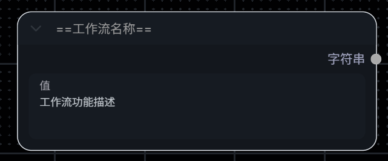
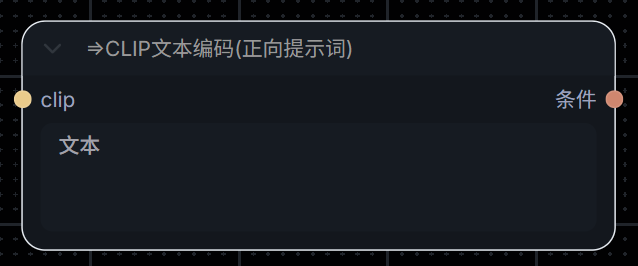

# ComfyUI-MCP-Server - ComfyUI Model Context Protocol Integration

<p align="center">
   [<a href="./README.md">简体中文</a>] 
   [<a href="./README-en.md">ENGLISH</a>] 
</p>

[](./LICENSE)
[](https://nodejs.org/)
[](https://modelcontextprotocol.io/)
[](https://github.com/orgs/MetaBrain-Labs)
[](https://deepwiki.com/MetaBrain-Labs/ComfyUI-MCP-Server-TypeScript)

**ComfyUI-MCP-Server 是一个基于 MCP（Model Context Protocol / 模型上下文协议）的服务器实现，将 ComfyUI 中用户定义的工作流转化为参数可配置的 MCP 工具，供 AI 代理（Agents）直接使用。**

> 本项目提供 **Python** 与 **TypeScript** 两个独立语言版本，功能基本对等，可按需选用：
>
> [](https://github.com/MetaBrain-Labs/ComfyUI-MCP-Server-Python)
> [](https://github.com/MetaBrain-Labs/ComfyUI-MCP-Server-TypeScript)
>
> 注：Python 版本带有更多实验性功能，TypeScript 版本则更稳定。

## 📋 项目功能

通过本项目，您可以通过连接ComfyUI从而赋予 AI 助手（如 `Claude Desktop`、`Trae`、`Dify` 等）强大的多媒体生成能力：

| 能力                 | 说明                                                                                                           |
| -------------------- | -------------------------------------------------------------------------------------------------------------- |
| **图像/视频生成**    | 通过使用用户自定义工作流，驱动 AI 助手生成图像、视频等多媒体文件；支持 AI 修改由用户公布的节点参数以微调结果。 |
| **自定义工作流导入** | 可手动将 ComfyUI API 格式的 JSON 文件导入服务器工作流目录，自动完成校验与挂载后即刻可用。                      |
| **生成资产管理**     | 生成完成后，自动将多媒体文件下载并保存至本地指定目录。                                                         |
| **高级自定义执行**   | 支持由 AI 自行提供完整 API JSON 直接调度 ComfyUI（高级模式）。                                                 |
| **素材导入**         | 支持从本地路径或 HTTP URL 将图片/视频素材上传至 ComfyUI 输入目录，供工作流直接调用。                           |

## ✨ 项目特色

- 🔌 **工作流即工具**：将 ComfyUI 的节点图抽象为可供Agent使用的工具。
- 🎛️ **自定义参数暴露**：可在工作流中精确定义哪些参数对外可见，限定 AI 在暴露范围内操作，防止模型幻觉与误操作。
- 🔧 **零侵入接入**：无需修改 ComfyUI 本体或安装任何必要插件，部署即连，开箱即用。
- 📥 **自定义工作流导入**：可手动导入 API 格式的工作流 JSON 文件，通过校验后即刻对 Agent 可用，无需重启服务。
- 📂 **资产管理**：支持从本地路径或网络 URL 自动上传资源至 ComfyUI。
- ⚡ **流式与进度支持**：支持生成进度报告（需 Client/Host 支持）。
- 🌍 **国际化双语支持**：内置中英文（zh-CN/en）国际化。
- 🧩 **标准 MCP 适配**：全面支持 STDIO 与 Streamable HTTP 通信协议。
- 🔬 **Skills 支持**：包含项目技能手册SKILL.md，针对支持 Skills 的 AI 助手通过 Skills 进行深度优化。

更多详情可查阅 [为什么选择我们](./docs/zh-CN/md/why-us.md)

## 🧰 可用工具集

AI 代理可以通过 MCP 协议调用以下内置工具：

| 工具                    | 工具名称         | 描述                                                                                                                                                                               |
| ----------------------- | ---------------- | ---------------------------------------------------------------------------------------------------------------------------------------------------------------------------------- |
| `get_core_manual`       | 获取项目核心手册 | 【系统指引】核心协议与操作字典。初始化或调用其他工具前必须优先读取，获取最新参数填充策略与报错恢复机制。                                                                           |
| `get_workflows_catalog` | 获取工作流目录   | 【目录检索】获取当前服务器支持的所有工作流清单。涉及生图的指令必须精确匹配此清单，严禁伪造或猜测工作流名称。                                                                       |
| `get_workflow_API`      | 获取工作流详情   | 【工作流API】读取目标工作流的全量底层拓扑JSON。体积庞大，仅在执行异常需排查最底层逻辑时调用，严禁在常规业务中使用防污染上下文。                                                    |
| `mount_workflow`        | 挂载工作流       | 【参数挂载】提取目标生成任务的受支持交互参数Schema（屏蔽连线细节）。提交工作流任务前，必须调用此接口获取合法的参数键名表。                                                         |
| `queue_prompt`          | 执行工作流任务   | 【任务提交】向队列提交任务 Prompt。底层自动调度计算节点并向 Host 实时同步进度。必须确保所有键名已通过挂载校验，严禁编造键名。                                                      |
| `queue_custom_prompt`   | 执行自定义工作流 | 【高级模式】直接向队列提交完整的原生 ComfyUI API Prompt JSON。仅在调试底层方案或响应明确专家指令时开放，常规任务严禁使用。                                                         |
| `save_custom_workflow`  | 保存自定义工作流 | 【保存工作流】将自定义参数化工作流保存到服务器的工作流目录中并随后自动执行语法校验和挂载。提交的 JSON 必须符合规范（至少包含一处符合挂载规则的 ==名称== 节点），否则将被拒绝保存。 |
| `save_task_assets`      | 保存生成资产     | 【保存生成资产】获取指定任务 (prompt_id) 的执行历史，并将产生的所有多媒体生成物 (图片、视频、GIF等) 下载并保存到指定的本地目录中。                                                 |
| `interrupt_prompt`      | 取消任务         | 【任务取消】取消特定 `prompt_id` 的运算进程并强制移除队列中的等待项。                                                                                                              |
| `get_prompt_result`     | 获取任务结果     | 【输出快照与资产】获取特定 Prompt 执行完成后的节点快照，提取生成的目标媒体文件（图像/视频链接）或回溯 Traceback 诊断错误。                                                         |
| `get_system_status`     | 获取系统状态     | 【系统监控】采集内存、显存及 Python 运行时指标，用于排查 OOM 或服务死锁等底层异常。                                                                                                |
| `list_models`           | 检索模型文件     | 【模型目录】轮询本地磁盘模型存放区。参数涉及具体模型文件时，必须前置调用此接口枚举校准，严禁凭空伪造模型文件名。                                                                   |
| `upload_assets`         | ComfyUI导入资产  | 【上传文件】将本地文件或网络 URL 上传至 ComfyUI 服务器的 input 目录，以便在工作流中直接应用。                                                                                      |

## 🎬 演示视频

### 默认方式

点击下方图片观看演示视频。

<p align="center">
  <a href="https://www.youtube.com/watch?v=Aqi7yK7pPag">
    
  </a>
</p>

### API_JSON方式

点击下方图片观看演示视频。

<p align="center">
  <a href="https://www.youtube.com/watch?v=fGEUCbfrqK8">
    
  </a>
</p>

> [!NOTE]
> **特别提示**
>
> 如果您喜欢该项目或者觉得项目有帮助，请给项目点一个 `Star✨`。

## 🚀 快速开始

仅需两步，快速启动项目。

> 提醒：安装启动项目后，还需查阅[[使用教程](#usage)]，否则无法使用工作流相关功能。

### 准备工作（必需）

在启动本项目之前，请确保您的系统中已安装以下软件

- Node.js 18+ [[官方链接](https://node.org.cn/en)]
- ComfyUI 0.9.1+ [[官方链接](https://github.com/comfyanonymous/ComfyUI)]
- MCP 客户端/AI Agent，例如Claude Desktop、Cursor等

---

### 第一步：安装项目与依赖

**1. 克隆本项目**
在终端中执行以下命令：

```bash
git clone https://github.com/MetaBrain-Labs/ComfyUI-MCP-Server-TypeScript.git
```

**2. 移动到项目目录**

```bash
cd ComfyUI-MCP-Server-TypeScript
```

**3. 安装依赖**

```bash
npm install
```

---

### 第二步：配置环境与启动项目

#### 1. 项目环境配置

进入项目根目录，根据系统实际情况修改 .env 文件中的配置。
详细配置说明请查阅：[[环境变量](#config)]

#### 2. 连接并运行项目

根据您的需求选择传输方式以启动项目：

> [!TIP]
> **MCP传输机制**
>
> MCP 协议目前定义了两种客户端-服务器通信的标准传输机制：
>
> - STDIO
> - Streamable HTTP
>
> 本项目两者皆支持，请根据您的 MCP 客户端能力进行选择。
>
> 您有责任确保使用这些服务器符合相关条款，以及适用于您的任何法律、规则、法规、政策或标准。

**模式一：STDIO 连接 (推荐用于 Claude Desktop 等本地客户端)**

- **MCP客户端启动：**
  复制下述 JSON 文件，在 MCP 客户端的 MCP 配置中粘贴并修改即可。
  > [!NOTE]
  >
  > 部分 MCP 客户端配置 MCP Server 的方法请查阅：[[示例](#examples)]
  >
  > 其他项目设置请在环境变量中修改，参数详情请查阅：[[环境变量](#config)]
  >
  > 如果 ComfyUI 在云端运行，请将 "SYNC_MODE" 设置为 "manual"
  ```json
  {
    "mcpServers": {
      "comfy-ui-advanced": {
        "command": "npx",
        "args": [
          "tsx",
          "<项目根目录绝对路径，如 D:/ComfyUI-MCP-Server-TypeScript>"
        ],
        "env": {
          "LOCALE": "en",
          "MCP_SERVER_URL": "http://127.0.0.1:8189/mcp",
          "MCP_SERVER_IP": "127.0.0.1",
          "MCP_SERVER_PORT": "8189",
          "COMFY_UI_SERVER_IP": "http://127.0.0.1:8188",
          "COMFY_UI_SERVER_HOST": "127.0.0.1",
          "COMFY_UI_SERVER_PORT": "8188",
          "SYNC_MODE": "timed",
          "SYNC_POLL_INTERVAL_SECONDS": "3",
          "SYNC_EVENT_FALLBACK_INTERVAL_SECONDS": "300",
          "ONDEMAND_REFRESH_COOLDOWN_SECONDS": "3",
          "COMFY_UI_INSTALL_PATH": "",
          "WORKFLOW_NAME_REGEX": "^==(.+?)==$",
          "WORKFLOW_PARAM_REGEX": "^=>(.+)$",
          "LOG_LEVEL": "INFO"
        }
      }
    }
  }
  ```
- **终端启动：**
  ```bash
  # 终端连接启动方式无需配置json，直接在项目根目录下执行：
  npm run dev
  ```

**模式二：StreamHTTP 连接 (推荐用于网络化/分布式部署)**

- **MCP客户端启动：**
  StreamHTTP 的项目设置在 [[.env](./.env)] 中指定，无需在下述 JSON 中配置。
  > [!NOTE]
  >
  > 部分 MCP 客户端配置 MCP Server 的方法请查阅：[[示例](#examples)]
  >
  > 目前支持 StreamHTTP 的 MCP Client/Host 较少，请根据需求使用。
  >
  > 如果 ComfyUI 在云端运行，请在 [[.env](./.env)] 中将 "SYNC_MODE" 设置为 "manual"
  ```json
  {
    "mcpServers": {
      "comfy-ui-advanced-http": {
        "url": "http://127.0.0.1:8189/mcp"
      }
    }
  }
  ```
- **终端启动：**
  ```bash
  # 启动 Streamable HTTP
  npm run dev
  ```

至此，项目部署且启动完成。若您需要调试工具，请继续阅读下文，否则请直接跳转至[[使用教程](#usage)]。

### 调试工具 (MCP Inspector)

Inspector是MCP官方提供的MCP调试工具，推荐使用StreamHTTP作为Inspector的连接方式。

- 克隆项目
- 安装相关依赖
  ```bash
  npm install
  ```
- 启动StreamHTTP连接方式的Server：
  ```bash
  # 1. 在终端 A 启动 HTTP 服务
  npm run dev
  ```
- 启动Inspector：
  ```bash
  # 2. 在终端 B 启动 Inspector
  npm run inspector
  ```

启动完成后，控制台中会出现类似下述地址，复制地址到浏览器后即可开始调试相关工具：

```bash
# 每次启动MCP_PROXY_AUTH_TOKEN都不一样，因此每次启动后需要及时切换链接
http://localhost:6274/?MCP_PROXY_AUTH_TOKEN=d66fcf6cbbb3723c60bfef51f020e5e96811002a675e7162b065b44f2fe377f3
```

inspector启动成功后，浏览器页面配置参考：


<a id="usage"></a>

## 📖 使用教程

本项目需要对 ComfyUI 工作流进行简单的特定标记，以使 AI Agent 能够准确识别和调用，可以通过以下两种方式添加可用工作流：

### 标记规则（必须了解）

无论使用哪种方式添加可用工作流，都必须在其工作流中添加以下标记节点：

#### 1. 定义工具名称与功能描述（必须）

- 新建一个 `PrimitiveNode` (基础节点) 或 `PrimitiveStringMultiline` (多行字符串节点)，**无需与任何节点连线**。
- 双击修改节点标题为 `==您的工作流名称==`（例：`==生图-文生图==`）。**注意：这是 AI Agent 将看到的工具名，必须确保唯一。**
- 在该节点的文本输入框中，写下这段工作流的**功能描述**（例："这是一个基础文生图流程，适合生成二次元图片"）。**描述越清晰，AI 越能准确判断何时调用。**

> [!TIP]
> **自动过滤：** 本项目会自动忽略没有 `==Workflow Name==` 格式的工作流，确保 AI 只在划定的安全范围内操作，避免模型幻觉。



#### 2. 暴露可自主修改的参数（可选）

- 如果您希望 AI 可以动态修改某些节点属性（例如：正向提示词、长宽尺寸、随机种子），需要暴露其参数。
- 找到目标节点（如：`CLIP Text Encode (Prompt)` 节点）。
- 双击修改其标题为 `=>参数描述`（例：`=>正向提示词` 或 `=>生成的图片宽度`）。
- 保存后，本服务器会自动将其解析为 MCP 工具的可变参数，AI 调用时将能按需填入值。

> [!TIP]
> **自动过滤：** 本项目会自动忽略没有 `=>` 标题前缀的其它全部常规节点参数及节点连接相关参数，确保 AI 只在划定的安全范围内操作，避免模型幻觉。<br>



---

### 方式一：在 ComfyUI 画布中设置（推荐）

适用于正在运行 ComfyUI 且支持新版工作流保存机制的用户：

1. 在 ComfyUI 中按照上述**标记规则**整理好节点。
2. 点击 ComfyUI 面板上的 **Save (保存)** 按钮。
   > 建议在保存后，先自行点击一次 **Queue Prompt (运行)** 测试，确保工作流能够正常跑通。
3. 工作流将被保存至 ComfyUI 的用户数据目录（通常为 `userdata/workflows/`）。
4. **工作流生效时间视 `SYNC_MODE` 配置而定**：
   - `timed` 模式（默认）：MCP 服务器会在后台定时轮询，自动发现新保存的工作流，并在自动校验通过后立即挂载成 AI Agent 可用的工具。
   - `manual` 模式：仅当 AI Agent 尝试调用工具库时才触发一次按需扫描。
   - `push` 模式（实验性功能）：需配合 ComfyUI 插件，可实现保存后实时主动推送到服务器。

### 方式二：手动导入 API 格式 JSON 文件

适用于外部导入工作流或直接编写纯 API 格式（API Format）的工作流文件：

1. 准备好您的 ComfyUI API 格式 JSON 文件。
2. 使用文本编辑器打开该 JSON 文件，添加以下内容以符合**核心标记规则**：
   - **工具名称：** 在任意位置添加以下内容：

   ```json
    "99": {
      "inputs": {
        "value": "**功能描述**"
      },
      "class_type": "PrimitiveStringMultiline",
      "_meta": {
        "title": "==工作流名称=="
      }
    }
   ```

   > "99" 仅为示例，实际使用时请使用未被占用的节点 ID。<br>
   > 添加完毕后请检查json格式是否正确，每个节点后都需添加逗号，否则将导致工作流无法使用。
   - **暴露参数：** 找到需要让 AI 修改的参数所在的节点，添加或修改 `_meta` 对象中的 `"title": "=>参数描述"`。

3. 将修改后的 JSON 文件直接放入本项目的 `workflow/` 目录下（如果该目录不存在，请手动创建）。
4. **工作流生效机制与上述相同**，依据 `SYNC_MODE` 模式：
   - `timed` 模式（默认）：MCP 服务器将定时扫描该目录，自动解析参数并完成挂载。
   - `manual` / `push` 模式：工作流将在 AI Agent 下次请求工作流或执行工具时按需加载生效。

> [!NOTE]
>
> **关于任务队列中出现错误/失败任务的说明**
>
> 在使用本项目期间，ComfyUI 任务队列（Queue）中可能会偶尔出现报错红框或提示失败的任务。这是因为本 MCP 服务器需要在后台通过 ComfyUI 引擎静默校验您的工作流拓扑及节点合法性，以验证其是否适合供 AI 调用。**这属于正常现象，完全不会影响其他绘图和 AI 的正常工作，请放心忽略。**

<a id="config"></a>

## ⚙️ 环境配置

> [!TIP]
> **注意**
>
> 下列是本服务器的全部环境配置参数以及对应的介绍，请优先阅读此。
>
> 下列环境配置参数中部分还未启用，未启动的均为后续计划中使用的。

<details open>
<summary>点击查看完整配置文件说明</summary>

```
# =============================================================================
# ComfyUI MCP Server - Configuration
# 配置文件说明：
#   [User Config]   用户配置 —— 根据您的部署环境修改此区块
#   [System Config] 系统配置 —— 保持默认即可，无需修改
# =============================================================================

# =============================================================================
# [User Config] 用户配置
# Modify this section based on your deployment environment.
# 根据您的部署环境修改以下内容。
# =============================================================================

# Language for MCP tool descriptions.
# MCP 工具描述的显示语言。可选值：en（英文）| zh（中文）
LOCALE=en

# -----------------------------------------------------------------------------
# ComfyUI Server Connection / ComfyUI 服务器连接
# -----------------------------------------------------------------------------

# Full URL of your ComfyUI server. No trailing slash.
# ComfyUI 服务器的完整地址，末尾不加斜杠。
COMFY_UI_SERVER_IP="http://192.168.0.171:8188"

# Host (without protocol) and port. Used separately for WebSocket connections.
# 主机名（不含协议头）和端口号，WebSocket 连接时单独使用。
COMFY_UI_SERVER_HOST="192.168.0.171"
COMFY_UI_SERVER_PORT="8188"

# -----------------------------------------------------------------------------
# Sync Mode / 同步模式
# -----------------------------------------------------------------------------

# Controls how the server detects workflow updates from ComfyUI.
# 控制服务器检测 ComfyUI 工作流更新的方式。
#
#   timed  — Background loop polls ComfyUI at a fixed interval. (default)
#             后台循环以固定间隔轮询 ComfyUI。（默认）
#
#   push   — [Experiments] ComfyUI plugin sends real-time save events; long fallback poll as safety net.
#             Requires COMFY_UI_INSTALL_PATH (must be on same machine as ComfyUI).
#            [实验性功能] ComfyUI 插件实时推送保存事件；兜底长轮询作为安全网。
#             需要配置 COMFY_UI_INSTALL_PATH（需与 ComfyUI 同机部署）。
#
#   manual — No background loop. Refresh only when tools are called
#             (get_workflows_catalog / mount_workflow / queue_prompt).
#             无后台循环，仅在调用工具时按需刷新
#             （get_workflows_catalog / mount_workflow / queue_prompt）。
#
SYNC_MODE=timed

# Polling interval in seconds for timed mode.
# timed 模式的轮询间隔（秒）。
SYNC_POLL_INTERVAL_SECONDS=3

# Fallback polling interval in seconds for push mode (safety net for missed events).
# push 模式的兜底轮询间隔（秒），用于捕捉遗漏的推送事件。
SYNC_EVENT_FALLBACK_INTERVAL_SECONDS=300

# Cooldown in seconds between manual mode refreshes.
# Prevents excessive ComfyUI API calls when tools are called in quick succession.
# manual 模式两次刷新之间的冷却时间（秒），防止工具短时间内连续调用时频繁请求 ComfyUI API。
ONDEMAND_REFRESH_COOLDOWN_SECONDS=30

# -----------------------------------------------------------------------------
# Push Mode Plugin / 推送模式插件（仅 SYNC_MODE=push 时需要）
# -----------------------------------------------------------------------------

# Absolute path to your LOCAL ComfyUI installation root directory.
# Required when SYNC_MODE=push: MCP Server will automatically deploy a lightweight
# backend plugin that pushes workflow save events in real-time.
# Leave blank if ComfyUI runs on a remote machine or if using timed/manual mode.
#
# 本地 ComfyUI 安装目录的绝对路径。
# 使用 SYNC_MODE=push 时必填：MCP Server 会自动部署一个超轻量推送插件，
# 实现工作流保存后的实时推送通知。
# 若 ComfyUI 部署在远端机器上，或使用 timed/manual 模式，请留空。
#
# Windows 示例 / Example: COMFY_UI_INSTALL_PATH=C:/ComfyUI
# Linux   示例 / Example: COMFY_UI_INSTALL_PATH=/home/user/ComfyUI
COMFY_UI_INSTALL_PATH=

# -----------------------------------------------------------------------------
# Workflow Marker Patterns / 工作流标识符正则表达式
# -----------------------------------------------------------------------------

# Regex identifying the workflow name node (title of a PrimitiveStringMultiline node).
# Must contain ONE capture group that extracts the MCP tool name.
# Default matches titles like "==my_workflow=="
# 工作流名称节点的标识正则（PrimitiveStringMultiline 节点的 title）。
# 必须含一个捕获组提取工具名，默认匹配 ==名称== 格式。
WORKFLOW_NAME_REGEX=^==(.+?)==$

# Regex identifying configurable parameter nodes.
# Must contain ONE capture group that extracts the parameter description.
# Default matches titles like "=>prompt text"
# 参数节点的标识正则，必须含一个捕获组提取参数描述，默认匹配 =>描述 格式。
WORKFLOW_PARAM_REGEX=^=>(.+)$

# =============================================================================
# [System Config] 系统配置
# Internal settings — change only if you know what you are doing.
# 内部运行参数，通常无需修改。
# =============================================================================

# -----------------------------------------------------------------------------
# MCP Server / MCP 服务地址
# -----------------------------------------------------------------------------

# MCP server bind address and listening port.
# MCP 服务器的监听地址和端口（MCP 客户端连接此处）。
MCP_SERVER_URL="http://192.168.0.192:8189/mcp"
MCP_SERVER_IP="192.168.0.192"
MCP_SERVER_PORT="8189"

# -----------------------------------------------------------------------------
# Logging / 日志配置
# -----------------------------------------------------------------------------

# Minimum log level written to stderr.
# 输出到 stderr 的最低日志级别。
# DEBUG | INFO | WARNING | ERROR  (default: INFO)
LOG_LEVEL=INFO

# Optional absolute path for a log file.
# When set, logs are written to BOTH stderr and this file.
# Leave blank to disable file logging.
# 可选：日志文件的绝对路径。填写后同时输出到 stderr 和文件。留空则不开启文件日志。
# LOG_FILE=

# Log file rotation size. Default: 10 MB
# 日志文件切割大小，默认 10 MB。
# LOG_ROTATE=10 MB

# Number of rotated log files to retain. Default: 7
# 保留历史日志文件个数，默认 7。
# LOG_RETAIN=7
```

</details>

<a id="examples"></a>

## 示例

### Cluade Desktop

点击下方图片观看演示视频。

<p align="center">
  <a href="https://www.youtube.com/watch?v=gC78RJ8wTRU">
    
  </a>
</p>

### Trae

点击下方图片观看演示视频。

<p align="center">
  <a href="https://www.youtube.com/watch?v=V-c_FrojPt0">
    
  </a>
</p>

## 🛠️ 故障排除

### 常见问题

1. **WebSocket 连接失败**
   - 确保 ComfyUI 正在运行
   - 检查 ComfyUI 的 WebSocket 端口配置
   - 检查 `.env` 中的 `COMFY_UI_SERVER_HOST` 与 `PORT` 是否准确配置。
2. **工作流执行失败**
   - 检查提交的参数类型是否与目标节点的要求（Schema）匹配。
   - 检查 ComfyUI 控制台是否有缺失自定义节点（Custom Nodes）的报错。
   - 查看 MCP Client/Host 对应 MCP Server 日志获取详细错误信息
3. **会话过期**
   - 默认 HTTP 会话超时时间为 30 分钟。如果进行超长视频渲染，可通过修改代码中的 `SESSION_TIMEOUT` 常量来延长。

## 🔬 技术细节

### 核心协议

1. **MCP (Model Context Protocol)**

   [What is the Model Context Protocol (MCP)? - Model Context Protocol](https://modelcontextprotocol.io/docs/getting-started/intro)

2. **JSON-RPC 2.0**

   [JSON-RPC 2.0 Specification](https://www.jsonrpc.org/specification)

3. **WebSocket**

   [The WebSocket API (WebSockets) - Web APIs | MDN](https://developer.mozilla.org/en-US/docs/Web/API/WebSockets_API)

4. **REST API**

   [About the REST API - GitHub Docs](https://docs.github.com/en/rest/about-the-rest-api/about-the-rest-api?apiVersion=2022-11-28)

### 技术限制与安全考量

- **依赖性**：强依赖 ComfyUI 原生 API 与 WebSocket，不支持非 ComfyUI 标准格式的图表导入。
- **安全验证**：当前版本未实现强鉴权机制（Token/Auth），请**不要**将其暴露在公网环境下运行。建议在生产环境中配置 HTTPS 以及额外的网关层访问控制。
- **资源消耗**：高并发调用可能导致 ComfyUI 宿主机显存溢出（OOM），请在 AI 系统提示词中限制其并发请求频率。

### **工作流校验准确性**

本项目将工作流校验准确性分为三种模式：

- 通过历史任务：根据**已执行完毕且执行结果为SUCCESS**的历史任务校验。
  - 此方式可确保在模型等核心不受影响的情况下，保证工作流执行的成功率。
- 仅通过初始工作流：根据**无历史任务或历史任务的执行时间在其对应工作流最新修改时间之前**的工作流校验。
  - 此方式仅会针对工作流进行初步校验——保证结点间联通无异常，但并不保证工作流完整流程运行成功。
  - 为保证生成图片的成功率，可考虑手动运行相关工作流。在工作流完整流程运行成功之后，历史任务中会产生对应的任务记录，后续AI工具即可识别为通过历史任务校验。
- 外部导入：**AI/用户自行提供的 API JSON 文件**，在执行工作流前，无任何校验，不保证工作流完整流程运行成功。
  - 此方式不会进行任何校验，一切校验交由ComfyUI后端进行，如API JSON文件格式、结点以及参数范围有问题，ComfyUI后端会进行拦截，并返回相应报错信息。
  - 此方式为兜底生成图片措施，在上述历史任务生成图片、初始工作流生成图片都无法使用的情况下使用。

## 🗺️ 后续计划

> [!TIP]
> **注意**
>
> 我们正积极扩展项目功能，如果您有好的建议，欢迎提交 Issue！

- [ ] **增强工作流解析**：支持更复杂的嵌套节点与动态参数提取。
- [ ] **云服务集成**：适配主流 ComfyUI 云端托管平台（鉴权与 API 映射）。
- [ ] **连接优化**：完善 StreamHTTP 下的断线重连机制与状态保持。
- [ ] **性能面板**：增加可视化的资源占用与任务排队监控状态反馈。
- [ ] **ComfyUI 插件**：开发 ComfyUI 插件，实现与 MCP 服务的无缝集成。

## 🤝 贡献

欢迎贡献！请随时提交 Pull 请求。

### 贡献指南

1. Fork 项目
2. 创建功能分支
3. 提交更改
4. 推送到分支
5. 打开 Pull Request

## 📄 许可证

本项目基于 **MIT** 许可证开源 - 详情请参阅 [LICENSE](./LICENSE) 文件。

_本项目为第三方社区开源驱动，并非 ComfyUI 官方产品，由 [MetaBrain-Labs](https://github.com/MetaBrain-Labs) 贡献孵化。_

## 📬 联系方式

_(注：因工作原因，邮件可能无法及时回复，请优先使用 GitHub Issues)_

### 问题/需求提交

[MetaBrain-Labs(metabrain0302@163.com)](mailto:metabrain0302@163.com)

### 贡献者

`TypeScript` 版本作者：

[LaiFQZzr(lfq2376939781@gmail.com)](mailto:lfq2376939781@gmail.com)

[](https://github.com/LaiFQzzr)

`Python` 版本作者：

[OldDeer(q1498823915@outlook.com)](mailto:q1498823915@outlook.com)

[](https://github.com/OldDeer00)

## 免责声明

> [!WARNING]
> **免责声明**
>
> 我们目前**没有**官方网站。您在网上看到的任何相关网站均为非官方性质，与本开源项目无关，请自行甄别风险。
>
> **并且我们不提供任何收费服务，并且请用户注意TOKEN使用情况，产生任何损失与该组织无关。**
